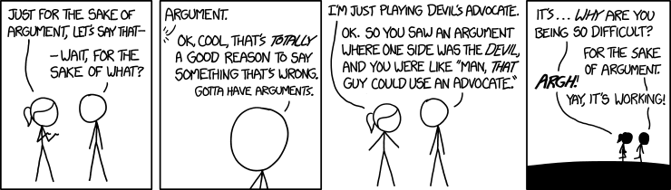

# Autopsy 3: The Controversial PEP

## PEP 572 — Assignment Expressions (Walrus Operator)

*The python-dev mailing list, circa 2018 (colorized).*

- **Proposed by:** Chris Angelico, Guido van Rossum
- **Status:** Final (Accepted)
- **Python:** 3.8+
